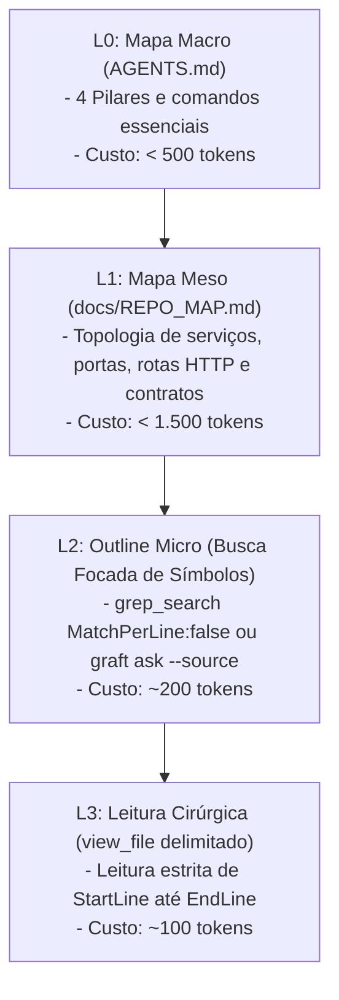

# Gestão Ativa de Contexto, Repo Mapping & Economia de Tokens

Estratégias de preservação de contexto, navegação progressiva em camadas e contenção de degradação de atenção para o Hephaestus LLM Studio.

---

## 1. O Orçamento da Janela de Contexto (Heurística Operacional)

- **Zona Saudável (15% a 35% de ocupação):** Faixa de trabalho ideal onde os modelos apresentam máxima acurácia analítica, aderência a regras e ausência de alucinações.
- **Ponto de Inflexão (~40% de ocupação):** Alerta operacional crítico. Ao atingir essa faixa durante tarefas lógicas ou arquiteturais, acione imediatamente o padrão **"Documentar e Limpar"** antes de abrir novos épicos ou fatias.
- **Zona de Atenção (>60% de ocupação):** Alta probabilidade de degradação de atenção (*lost-in-the-middle*). Permitido apenas para revisões mecânicas finais de diff; nunca para concepção de novos contratos ou arquiteturas.

---

## 2. Progressive Disclosure em Três Níveis

| Nível | Arquivo | Conteúdo & Papel | Custo Típico |
| :--- | :--- | :--- | :--- |
| **Nível 1 (Sempre Carregado)** | `AGENTS.md` | Comandos essenciais, 4 pilares, regras inegociáveis, mapa do sistema (<150 linhas). | < 500 tokens |
| **Nível 1.5 (Condicional)** | `.agents/rules/*.md` | Regras especializadas (Git, arquitetura, segurança, subagentes). Lidas conforme a stack. | 500 a 1.500 tokens |
| **Nível 2 (Sob Demanda)** | `docs/*.md` | Documentação técnica aprofundada, ADRs específicas e casos extremos. | Apenas sob demanda |

---

## 3. Funil de Navegação Progressiva (L0 → L3)

Para evitar queima desenfreada de tokens e poluição da janela com dumps de arquivos:

1. **L0 (Macro):** Consultar `AGENTS.md` para identificar o pilar, stack e comandos determinísticos do módulo.
2. **L1 (Meso):** Consultar `docs/REPO_MAP.md` para inspecionar endpoints, tabelas e wiring entre serviços sem abrir código-fonte.
3. **L2 (Micro):** Utilizar `grep_search` com `MatchPerLine: false` ou `graft ask "<termo>" --source` para descobrir os arquivos e linhas exatas que contêm os símbolos desejados.
4. **L3 (Cirúrgico):** Utilizar `view_file` especificando estritamente `StartLine` e `EndLine`. **É expressamente proibido ler arquivos inteiros com mais de 100 linhas.**

---

## 4. O Padrão "Documentar e Limpar" (*Document and Clean*)

Para sessões longas ou tarefas complexas:
1. O agente registra o progresso, aprendizados e próximas tarefas em `tasks/todo.md`.
2. O Orquestrador executa a validação e grava um commit atômico na branch.
3. A janela de contexto da sessão é reiniciada/limpa.
4. A nova sessão inicia com mais de 90% da janela livre, retomando o trabalho a partir de `AGENTS.md` e `tasks/todo.md`.

---

## 5. A Regra das Duas Correções (*Two-Correction Rule*)

- Se um subagente ou o orquestrador tentar corrigir uma mesma falha de build, teste ou lint **duas vezes consecutivas sem sucesso**, o contexto foi contaminado (*poisoned context*).
- **Ação Imediata e Obrigatória:**
  1. Interromper imediatamente novas tentativas na mesma sessão;
  2. Registrar a causa observada e o aprendizado em `tasks/todo.md`;
  3. Se for dúvida de design/contrato, despachar `@architect`; se for sobrecarga da sessão, solicitar reset de contexto ao usuário.
  4. **Nunca tentar um terceiro fix cego na mesma janela saturada.**
