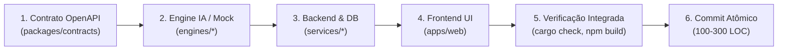

# Engenharia de Sistemas Multiagente (Harness Engineering)

Diretrizes de orquestração de subagentes, controle de concorrência, posse de arquivos e protocolos de comunicação para o Hephaestus LLM Studio.

---

## 1. As Três Camadas de Maturidade

| Camada | Escopo | Controla | Resolve Falhas de |
| :--- | :--- | :--- | :--- |
| **Prompt Engineering** | Uma única interação | Redação de instruções e prompts | Respostas fora de tom, ambiguidade |
| **Context Engineering** | Janela de contexto, múltiplos turnos | Seleção, ordenação e compactação de tokens | Informação ausente ou poluição de contexto |
| **Harness Engineering** | Sistema inteiro de agentes, múltiplas sessões | Orquestração de ferramentas, loops de verificação, memória em disco e guardrails | Deriva entre sessões, loops infinitos, ações destrutivas e alucinações de arquitetura |

---

## 2. Topologia Hub-and-Spoke & Hierarquia Canônica

```text
Orquestrador (Supervisor / Hephaestus)
   ├── Subagente Frontend (apps/web — Next.js/TS)
   ├── Subagente Rust Backend (services/* — Axum/SQLx)
   ├── Subagente Python Engines (engines/* — PyTorch/uv)
   ├── Subagente Infraestrutura (infra/*, Dockerfile, CI)
   ├── Subagente Docs Sync (docs, contracts — Sincronização mecânica)
   ├── Subagente Fixer (Correção cirúrgica de build/lint — máx 2 tentativas)
   └── Subagente Guardian / Reviewer (Auditoria e refatoração arquitetural sob demanda)
```

- **Orquestrador Central:** Centraliza todas as decisões, decompõe objetivos em DAG, despacha workers especializados, sintetiza entregas e realiza commits locais validados.
- **Isolamento entre Subagentes:** Subagentes **nunca se comunicam diretamente entre si**, prevenindo divergências conceituais e desalinhamentos de implementação.
- **Workers Especialistas:** Escopo estreito e focado ("um agente, uma responsabilidade clara"). Trabalham em contexto próprio, limpo e isolado.

---

## 3. Concorrência & Princípio de Disjunção de Arquivos (File Ownership)

- **Princípio de Disjunção Estrita:** Workers disparados em paralelo devem receber conjuntos de arquivos ou diretórios **completamente disjuntos** (ex: Worker A altera exclusivamente `apps/web/`, Worker B altera exclusivamente `services/api-principal/`).
- **Contratos Compartilhados (`packages/contracts/` e Migrations):** Schemas OpenAPI, DTOs compartilhados ou migrations de banco NUNCA devem ser editados concorrentemente. Devem ser atualizados **sequencialmente** pelo Orquestrador antes do despacho paralelo.
- **Serialização Obrigatória:** Se duas tarefas dependem do mesmo módulo ou arquivo central, o Orquestrador **obrigatoriamente serializa** os passos no Grafo DAG:
  `Worker 1 executa e valida -> Orquestrador comita -> Worker 2 assume a partir do novo estado`.

---

## 4. Fluxo em Grafo DAG Explícito

A implementação de novas fatias verticais segue rigorosamente a ordem do DAG:



---

## 5. Relatório Sintético Obrigatório

Subagentes **não devem despejar logs massivos** de terminal no retorno para o Orquestrador. O relatório final de qualquer subagente deve ter entre **15 e 30 linhas**, estruturado em quatro blocos:

1. **Arquivos criados ou modificados:** Lista precisa com caminhos relativos.
2. **Decisões técnicas adotadas:** Resumo conciso do que foi feito e premissas assumidas.
3. **Resultado das verificações:** Comando exato executado (`cargo check`, `npm run build`, `compileall`) e evidência de sucesso.
4. **Próximos passos / Recomendações:** Apontamento de pendências ou observações para o próximo elo da cadeia.

---

## 6. Architecture Guardian (Ativação Estritamente Sob Demanda)

- **Papel:** Auditar e garantir a conformidade dos 4 pilares, Clean Architecture, isolamento de rede das engines e invariantes de segurança.
- **Gatilho de Ativação:** Estritamente **sob demanda e reativo**:
  - Invocado pelo Orquestrador quando linters ou scripts de arquitetura detectam violações;
  - Invocado antes do fechamento de fatias verticais críticas (novos endpoints, migrations, mudanças de boundary).
- **Proibição Absoluta de Agentes Faxineiros Contínuos:** É expressamente **proibido** manter subagentes rodando em loop background ou cron no ambiente de desenvolvimento. Verificações contínuas devem ser 100% determinísticas via linters/scripts (<50ms e custo zero de tokens).
