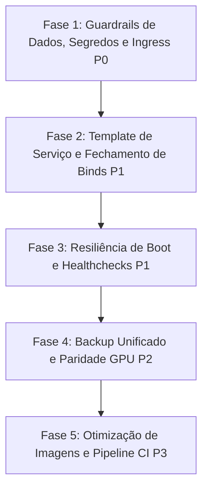

# Auditoria de Infraestrutura — Hephaestus LLM Studio

> **Data:** 2026-09-19  
> **Status:** Concluído (Somente Leitura)  
> **Arquivos Auditados:** `infra/compose.yaml`, `infra/compose.prod.yaml`, `infra/compose.gpu.yaml`, `infra/compose.integ.yaml`, `infra/Caddyfile`, `infra/seaweedfs-s3.json`, `infra/scripts/ensure-bucket.sh`, `infra/.env.example`, `infra/env.gpu.example`, `infra/README-gpu.md`, `.gitea/workflows/ci.yml`, `.gitea/workflows/release.yml`, Dockerfiles (`services/*`, `apps/*`, `engines/*`), `scripts/*.sh`.  
> **Documentação de Referência:** `docs/infra/overview.md`, `docs/infra/gpu-nodes.md`, `docs/infra/storage-and-persistence.md`.

---

## 1. Resumo Executivo e Métricas Quantitativas

A auditoria de infraestrutura avaliou os 4 perfis de implantação Compose (`dev`, `prod`, `gpu`, `integ`), o ingress Caddy, o isolamento de rede, a segurança do Docker socket, as rotinas de persistência e backup, a coerência dos Dockerfiles e a aderência aos 4 pilares do Hephaestus LLM Studio.

O sistema demonstra solidez arquitetural na separação de responsabilidades (BFF público vs nós de execução isolados), uso de compilação multi-stage com bases Debian/Rust pinadas por digest, e adoção de um script idempotente em POSIX `sh` com SigV4 manual (`ensure-bucket.sh`). Contudo, foram identificadas **vulnerabilidades críticas de segurança, drifts operacionais severos entre documentação e código real, e lacunas de resiliência** que comprometem a reprodutibilidade de produção e a autonomia operacional.

### 1.1 Tabela de Métricas Quantitativas

| Métrica | Dev (`compose.yaml`) | Prod (`dev + prod.yaml`) | GPU (`compose.gpu.yaml`) | Integ (`dev + integ.yaml`) |
| :--- | :---: | :---: | :---: | :---: |
| **Total de Serviços Ativos** | 8 (+ 2 build) | 9 (+ 2 build) | 1 (+ 2 build) | 8 (+ 2 build) |
| **Healthchecks Declarados** | 3 / 8 (**37.5%**) | 3 / 9 (**33.3%**) | 1 / 1 (**100%**) | 3 / 8 (**37.5%**) |
| **Limites de Recursos (`deploy.resources.limits`)** | 0 / 8 (**0%**) | 0 / 9 (**0%**) | 0 / 1 (**0%**) | 0 / 8 (**0%**) |
| **Logging Padronizado (`*default-logging`)** | 3 / 8 (**37.5%**) | 3 / 9 (**33.3%**) | 0 / 1 (**0%**) | 3 / 8 (**37.5%**) |
| **Execução Non-Root (`USER` explícito)** | 1 / 8 (**12.5%**) | 1 / 9 (**11.1%**) | 0 / 1 (**0%**) | 1 / 8 (**12.5%**) |
| **Imagens Base Pinadas por Digest** | 8 / 8 (**100%** bases) | 8 / 9 (**88.9%**) | 3 / 3 (**100%**) | 8 / 8 (**100%**) |
| **Portas Publicadas no Host** | 7 portas | 5 portas | 1 porta (`8082`) | 7 portas |
| **Portas com Bind `127.0.0.1` Explícito** | 5 / 7 (**71.4%**) | 3 / 5 (**60%**) | 0 / 1 (**0%**) | 5 / 7 (**71.4%**) |
| **Fail-Fast de Credenciais (`${VAR:?}`)** | 0 / 7 vars (**0%**) | 4 / 7 vars (**57.1%**) | 0 / 3 vars (**0%**) | 0 / 7 vars (**0%**) |

- **Linhas Totais de Configuração Infra:** 1.167 linhas (`infra/`) + 1.957 linhas (`Dockerfiles` + `scripts/`).
- **Linhas Duplicadas / Redundantes nos Composes:** ~48 linhas repetindo definições de ambiente e volumes.
- **Tamanho Estimado da Imagem Web:** ~850 MB (sem `output: 'standalone'`) vs ~150 MB alvo.

---

## 2. Divergências entre a Documentação e os Arquivos Reais

A documentação em `docs/infra/` foi tratada como hipótese e contrastada com o código real. Foram detectadas divergências profundas:

| Tópico | O que a Documentação afirma | O que o Código Real implementa | Impacto |
| :--- | :--- | :--- | :--- |
| **Limites de Recursos em Produção** | `docs/infra/overview.md:129-140` apresenta tabela detalhada com limites de RAM e CPU para todos os serviços (`db` 2GB, `seaweedfs` 1.5GB, `principal` 1GB, etc.). | `infra/compose.prod.yaml` possui **zero** blocos `deploy.resources.limits`. Nenhum serviço tem limites declarados. | **Alto:** Risco de OOM killer e starvation de CPU/RAM em produção. |
| **Ingress TLS e Porta 443** | `docs/infra/overview.md:84` afirma que o Caddy atua como proxy reverso unificado na porta 80/443 com TLS. `compose.prod.yaml:14-15` publica `80:80` e `443:443`. | `infra/Caddyfile:2` define **exclusivamente o bloco `:80`**. Não há bloco `:443`, certificados nem configuração de domínio TLS. Conexões HTTPS falham/rejeitam. | **Crítico:** Produção não opera em HTTPS real. |
| **Tuning do PostgreSQL + pgvector** | `docs/infra/storage-and-persistence.md:39-48` descreve parâmetros de tuning (`shared_buffers=512MB`, `work_mem=32MB`, `maintenance_work_mem=128MB`). | `infra/compose.yaml:8-26` não possui `command:` com flags do Postgres. O banco roda com defaults mínimos (128 MB `shared_buffers`). | **Médio:** Degradação de performance em buscas vetoriais HNSW. |
| **Intervalo de Heartbeat e Telemetria** | `docs/infra/overview.md:84` e `docs/infra/gpu-nodes.md:84` afirmam: *"A cada 5 segundos, o orchestrator executa o utilitário nvidia-smi no nó TrueNAS e envia ao manager"*. | `services/orchestrator/src/main.rs:232` usa `Duration::from_secs(2)` (2s hardcoded). `services/manager/src/lib.rs:2228` usa 10s de tolerância (`<= 10`). | **Baixo:** Descompasso de documentação; valores soltos sem configuração por env. |
| **Cache de Modelos no Nó GPU** | `docs/infra/storage-and-persistence.md:113` cita o volume `models` para cache de pesos. | `infra/compose.gpu.yaml:90-92` declara apenas `gpu_datasets` e `gpu_outputs`. O volume `models` **não existe** no nó GPU; os modelos são cacheados em `/outputs/.cache` (`Dockerfile.gpu:33`). | **Médio:** Mistura artefatos gerados com downloads pesados de checkpoints. |
| **Execução dos Testes de Integração em CI** | `docs/infra/overview.md:181` cita o comando `docker compose -f compose.yaml -f compose.integ.yaml up --abort-on-container-exit`. | `.gitea/workflows/ci.yml:112` executa **apenas** `docker compose ... config -q` (validação sintática). Nenhum container sobe e nenhum teste de integração dockerizado roda no CI. | **Alto:** Falsa sensação de cobertura; CI não testa a stack integrada. |
| **Isolamento de Portas no Overlay Prod** | `docs/infra/overview.md:14` e `:88` afirmam que o overlay fecha portas diretas do host, expondo apenas Caddy 80/443. | `infra/compose.prod.yaml` fecha `web`, `principal`, `manager` e `db`, mas **mantém abertas** as portas de `seaweedfs` (`8333`, `9333`), `embedder` (`8090`) e `orchestrator-local` (`8082`). | **Alto:** Bypass direto do proxy ingress em produção. |
| **IPs e Configuração do Nó GPU** | `infra/env.gpu.example` sugere que `S3_ORCH_ENDPOINT_URL` e `MANAGER_URL` são configuráveis via `.env`. | `infra/compose.gpu.yaml:25,27` possui URLs com IPs hardcoded (`http://10.15.10.3:8081`, `http://10.15.10.3:8333`) como strings literais sem interpolação de variáveis. | **Crítico:** Falha de portabilidade em qualquer rede que não seja `10.15.10.3`. |

---

## 3. Matriz de Conformidade Serviço × Perfil

| Serviço | Perfil | Imagem / Pin | Portas & Bind | Healthcheck | Restart | Limites | Logging | Usuário | Depends On |
| :--- | :--- | :--- | :--- | :--- | :--- | :--- | :--- | :--- | :--- |
| **db** | dev, prod, integ | `pgvector/pgvector:pg16-trixie@sha256:c84...` (Digest) | dev: `${DB_PUBLISH:-127.0.0.1}:5432`<br>prod: `!override []` | `pg_isready -U studio -d studio` (5s, retries 10) | `unless-stopped` | **Nenhum** | `*default-logging` | postgres (uid 999) | — |
| **principal** | dev, prod, integ | Build: `rust:1.97.1-slim` + `debian:trixie-slim` (Digests) | dev: `8080:8080` (**0.0.0.0 implícito**)<br>prod: `!override []` | **Ausente** | `unless-stopped` | **Nenhum** | `*default-logging` | **root** (risco) | `db` (healthy), `seaweedfs` (healthy), `s3-init` (completed) |
| **seaweedfs** | dev, prod, integ | `chrislusf/seaweedfs:4.45_full@sha256:048...` (Digest) | dev: `${SEAWEED_PUBLISH:-127.0.0.1}:8333`<br>`127.0.0.1:9333`<br>prod: **Mantém exposto** | `wget -S http://localhost:8333/` (5s, retries 12) | `unless-stopped` | **Nenhum** | **Ausente** (padrão docker) | root | — |
| **s3-init** | dev, prod, integ | `alpine:3.20@sha256:d9e...` (Digest) | Nenhuma | **Ausente** (run-once) | `"no"` | **Nenhum** | **Ausente** | root | `seaweedfs` (healthy) |
| **embedder** | dev, prod, integ | Build: `python:3.12-slim@sha256:783...` (Digest) | dev: `127.0.0.1:8090`<br>prod: **Mantém exposto** | `python -c urllib...` (10s, retries 6) | `unless-stopped` | **Nenhum** | **Ausente** | `studio:1000` | — |
| **manager** | dev, prod, integ | Build: `rust:1.97.1-slim` + `debian:trixie-slim` (Digests) | dev: `${MANAGER_PUBLISH:-127.0.0.1}:8081`<br>prod: `!override []` | **Ausente** | `unless-stopped` | **Nenhum** | **Ausente** | **root** (risco) | `db` (healthy), `principal` (**started** - race condition), `s3-init` (completed) |
| **orchestrator-local** | dev, prod, integ | Build: `rust:1.97.1-slim` + `debian:trixie-slim` (Digests) | dev: `${ORCHESTRATOR_PUBLISH:-127.0.0.1}:8082`<br>prod: **Mantém exposto** | **Ausente** | `unless-stopped` | **Nenhum** | **Ausente** | **root** (socket docker) | `manager` (started), `s3-init` (completed) |
| **web** | dev, prod, integ | Build: `node:20-slim@sha256:2cf...` (Digest) | dev: `3000:3000` (**0.0.0.0 implícito**)<br>prod: `!override []` | **Ausente** | `unless-stopped` | **Nenhum** | `*default-logging` | **root** (risco) | `principal` (started) |
| **ingress** | prod | `caddy:2.8-alpine` (**Tag mutável, sem digest**) | prod: `80:80`, `443:443` | **Ausente** | `unless-stopped` | **Nenhum** | **Ausente** | root | `web`, `principal` |
| **orchestrator-gpu** | gpu | Build: `services/orchestrator/Dockerfile` (Digests) | gpu: `8082:8082` (**0.0.0.0 implícito**) | `/dev/tcp/localhost/8082` (10s, retries 5) | `unless-stopped` | **Nenhum** | **Ausente** | **root** (socket docker) | — |

---

## 4. Mapa Real de Rede e Fluxos vs. Regras Inegociáveis

### 4.1 Topologia Efetiva

```
[ BROWSER / INTERNET ]
        |
        v :80 / :443 (HTTP puro no Caddyfile!)
  +-------------------------------------------------------------+
  | INGRESS (Caddy 2.8) — infra_default                         |
  |  - /api/*    --> principal:8080 (flush_interval -1)         |
  |  - /metrics  --> principal:8080 (SEM AUTENTICAÇÃO)         |
  |  - /*        --> web:3000                                   |
  +-------------------------------------------------------------+
        |                                       |
        v                                       v
  [ web :3000 ]                         [ principal :8080 ]
  (Next.js App)                                 |
                                        +-------+-------+
                                        |               |
                                        v               v
                              [ manager :8081 ]   [ seaweedfs :8333 / :9333 ]
                                        |               ^
                                        v               |
                           [ orchestrator-local :8082 ]-+
                                        |
                          (/var/run/docker.sock)
                                        v
                          [ trainer-yolo / difusao ]
                          (Containers efêmeros sem portas publicadas)
```

### 4.2 Nós Remotos (TrueNAS GPU):
```
[ DEV HOST (10.15.10.3) ]                     [ TRUENAS (10.15.1.2) ]
  - manager :8081 (HTTP plaintext) <======= Heartbeat (Bearer token) ======= [ orchestrator-gpu :8082 ]
  - seaweedfs :8333 (HTTP plaintext) <===== Uploads/Downloads (SigV4) ====== [ trainer-gpu / difusao ]
```

### 4.3 Violações Encontradas contra as Regras Inegociáveis:
1. **Regra dos Binds em 127.0.0.1 em Dev:**
   - `web:3000` está publicado como `'3000:3000'` (bind implícito em `0.0.0.0`).
   - `principal:8080` está publicado como `'8080:8080'` (bind implícito em `0.0.0.0`).
   - Qualquer máquina na mesma rede Wi-Fi/LAN pode acessar o frontend e a API do dev host diretamente.
2. **Regra de Isolamento de Portas em Produção:**
   - `seaweedfs` (8333 e 9333), `embedder` (8090) e `orchestrator-local` (8082) **não são sobrescritos com `ports: !override []`** no `compose.prod.yaml`. Em prod, essas portas continuam abertas no host.
3. **Engines sem portas no host:**
   - **Respeitado:** Os containers de treinamento (`trainer-yolo`, `trainer-difusao`) não possuem blocos `ports:` e rodam na rede bridge interna.

---

## 5. Inventário de Segredos e Credenciais (Sem Expor Valores)

| Credencial | Origem / Configuração | Default Dev / Inseguro | Consumidor(es) | Rotação Suportada | Fail-Fast em Prod? |
| :--- | :--- | :--- | :--- | :---: | :---: |
| `POSTGRES_PASSWORD` | `.env` / Compose | `studio` | `db`, `principal`, `manager` | Manual (requer `ALTER USER` + reinício) | **SIM** (`${POSTGRES_PASSWORD:?}`) |
| `STUDIO_PASSWORD` | `.env` / Compose | `changeme` | `principal` (bootstrap de usuário admin) | Manual (recriação ou rotação de hash no DB) | **SIM** (`${STUDIO_PASSWORD:?}`) |
| `STUDIO_MASTER_KEY` | `.env.example` | `changeme` | `principal` | Manual | **NÃO** (Ausente no overlay de prod) |
| `AUTH_SECRET` | Env / DB fallback | Gerado dinamicamente no boot | `principal` (assinatura de JWT HS256) | Automática ou via env | **NÃO** (Não validado com `:?`) |
| `MANAGER_TOKEN` | `.env` / Compose | `changeme` | `principal`, `manager`, `orchestrator-local`, `orchestrator-gpu` | Manual (atualizar em todos os composes) | **PARCIAL** (Em `principal` e `manager`; **NÃO** em `orchestrator-local` nem `orchestrator-gpu`) |
| `S3_ACCESS_KEY` | `.env` / Compose | `heph` | `principal`, `s3-init` | Estática em `seaweedfs-s3.json` | **NÃO** |
| `S3_SECRET_KEY` | `.env` / Compose | `heph-local-dev` | `principal`, `s3-init` | Estática em `seaweedfs-s3.json` | **PARCIAL** (Validado no `principal`; **NÃO** em `s3-init`) |
| `S3_ORCH_ACCESS_KEY`| `.env` / Compose | `heph-orch` | `orchestrator-local`, `orchestrator-gpu` | Estática em `seaweedfs-s3.json` | **NÃO** |
| `S3_ORCH_SECRET_KEY`| `.env` / Compose | `heph-orch-local-dev` | `orchestrator-local`, `orchestrator-gpu` | Estática em `seaweedfs-s3.json` | **NÃO** (Falta `:?` em ambos orquestradores) |
| `seaweedfs-s3.json` | Arquivo versionado | Chaves fixadas em JSON | `seaweedfs` | Manual (arquivo estático montado) | **NÃO** (Chaves fracas commitadas no repositório) |
| `ORCH_PAIRING_CODE` | `compose.gpu.yaml` | `heph_p_change_me` | `orchestrator-gpu` | Single-use na adoção | **NÃO** (Default fraco estático) |
| `HF_TOKEN` | `.env` / `env.gpu` | Vazio | `orchestrator-local`, `orchestrator-gpu` | Via HuggingFace | **NÃO** |

---

## 6. Verificação dos Invariantes e das 8 Verificações Cruzadas

### 6.1 Invariantes Gerais

- **Engines sem portas no host:** **RESPEITADO.** Nenhuma engine mapeia portas.
- **Binds em 127.0.0.1 em Dev:** **PARCIALMENTE VIOLADO.** `principal` (8080) e `web` (3000) possuem bind implícito `0.0.0.0`.
- **Overlay de Prod unificado via Caddy:** **PARCIALMENTE VIOLADO.** `compose.prod.yaml` não fecha portas de `seaweedfs`, `embedder` e `orchestrator-local`.
- **Fail-fast contra credenciais padrão:** **PARCIALMENTE VIOLADO.** Cobre apenas 4 variáveis; deixa de fora credenciais do orchestrator, S3 admin no `s3-init` e SeaweedFS.
- **Postgres pinado por digest + healthcheck + migrações:** **RESPEITADO.** Imagem pinada por digest, `pg_isready` implementado, migrações SQLx embutidas no boot.
- **Container não-root e rotação de logs:** **VIOLADO.** Apenas 1 container roda como non-root (`embedder`), e apenas 3 serviços possuem rotação de logs configurada.

---

### 6.2 As 8 Verificações Cruzadas Obrigatórias

#### 1. Conectividade LAN do Nó GPU vs Binds em 127.0.0.1
- **Status:** **CONFIRMADO COM RISCO DOCUMENTADO.**
- **Evidência:** `compose.yaml:74,145` utiliza `${SEAWEED_PUBLISH:-127.0.0.1}` e `${MANAGER_PUBLISH:-127.0.0.1}`. Para o TrueNAS alcançar esses serviços, `README-gpu.md:88` exige alterar para o IP da interface LAN.
- **Risco:** O `manager` opera em HTTP puro na LAN autenticado apenas pelo `MANAGER_TOKEN` estático (vulnerável a sniffing/mitm). O SeaweedFS fica aberto para qualquer host da LAN em HTTP na porta 8333. A recomendação de firewall `ufw` existe nos docs, mas é manual e não há mTLS ou VPN nativa.

#### 2. Acoplamento de Heartbeat (5s doc vs 2s code) e Timeout de Stale (10s code)
- **Status:** **DESACOPLADO E DESALINHADO.**
- **Evidência:** 
  - `docs/infra/gpu-nodes.md:84`: documenta intervalo de 5s.
  - `services/orchestrator/src/main.rs:232`: `tokio::time::interval(std::time::Duration::from_secs(2))` (2 segundos hardcoded).
  - `services/manager/src/lib.rs:2228`: `(now - last).num_seconds() <= 10` (10 segundos hardcoded).
- **Consequência:** Não há variáveis de ambiente controlando o heartbeat nem a tolerância. Se a rede sofrer jitter e 5 heartbeats atrasarem (10s), o manager marca o nó como stale e cai no fallback não-medido.

#### 3. Cookie `heph_session` e `X-Forwarded-Proto` atrás do Caddy
- **Status:** **RESPEITADO NO BACKEND / QUEBRADO NO INGRESS.**
- **Evidência:** 
  - `services/api-principal/src/auth/handlers.rs:109-116`: A função `should_secure_cookie` inspeciona explicitamente o header `x-forwarded-proto == "https"` (adicionado na Wave 3, `RD-031`).
  - `infra/Caddyfile:10`: Injeta `header_up X-Forwarded-Proto {scheme}`.
  - **Porém:** `infra/Caddyfile:2` escuta apenas em `:80`! Como o Caddy nunca atende em HTTPS nativo, `{scheme}` é sempre `http`, e a flag `Secure` **nunca é emitida** a menos que `SECURE_COOKIE=true` seja forçado via env.

#### 4. Paridade de Limites de Corpo, Timeouts e SSE (Dev vs Prod)
- **Status:** **PARCIAL / ASSIMÉTRICO.**
- **Evidência:** 
  - Em Dev (`apps/web/next.config.ts:14-16`): `proxyClientMaxBodySize: "8200mb"`, `proxyTimeout: 900_000` (15 min).
  - Em Prod (`infra/Caddyfile:7-12`): `/api/*` vai direto para `principal:8080` com `flush_interval -1` (excelente para SSE). O Caddy não impõe limite de body por padrão (`request_body` ilimitado), mas o bloco `:80` possui `encode zstd gzip` no topo, o que pode intermediar ou bufferizar chunks de SSE se o Content-Type não for isolado. Além disso, a rota `/health` em dev cai no proxy do Next (`next.config.ts:27-29`), enquanto em prod não tem `handle` dedicado no Caddy e cai no `web:3000`.

#### 5. O que `docker-socket-proxy` Consegue de Fato Impor vs Invocação Real do Orchestrator
- **Status:** **INVIABILIDADE DO PROXY HTTP PARA BLOQUEIO DE VOLUMES.**
- **Evidência:** 
  - `services/orchestrator/src/adapters/executor_docker.rs:82`: O orchestrator invoca diretamente a CLI `docker` (`tokio::process::Command::new("docker")`), emitindo `docker run`, `docker stop`, `docker ps`, `docker rm`.
  - `docs/infra/overview.md:114-121`: A documentação reconhece corretamente que proxies como `docker-socket-proxy` filtram rotas/verbos HTTP (ex.: permitir `POST /containers/create`), mas **não inspecionam o corpo JSON** (`HostConfig.Binds`, `Privileged`).
  - Conclusão: Um `docker-socket-proxy` padrão não impede o orchestrator de montar volumes arbitrários do host. O orchestrator necessita rodar em VM dedicada, com sandboxing (gVisor/Kata) ou com `EXEC_MODE=subprocess`.

#### 6. Como as Imagens dos Trainers Chegam ao Nó GPU e Alcance do S3
- **Status:** **GAPS OPERACIONAIS CRÍTICOS.**
- **Evidência:** 
  - `infra/compose.gpu.yaml:69-89`: Os trainers estão marcados como `profiles: [build]`. Subir com `docker compose -p gpu up -d` **não constrói nem baixa as imagens de treino**. O operador é obrigado a clonar o repositório git no TrueNAS e rodar `docker compose --profile build build trainer-gpu` localmente (demorando 10-15 min e consumindo 15 GB).
  - No nó GPU, o orchestrator cria containers na rede `gpu_default` (`compose.gpu.yaml:45`). Os trainers alcançam `S3_ORCH_ENDPOINT_URL: http://10.15.10.3:8333` via NAT do host TrueNAS pela interface física da LAN. Se `SEAWEED_PUBLISH` no dev host estiver no padrão `127.0.0.1`, a engine no TrueNAS falha com `Connection Refused`.

#### 7. Propriedade das Migrações SQLx e Race Condition no Boot do Manager
- **Status:** **RACE CONDITION CRÍTICA DETECTADA.**
- **Evidência:** 
  - `services/api-principal/src/main.rs:146`: Apenas `api-principal` executa `sqlx::migrate!("./migrations").run(&pool).await` em runtime.
  - `infra/compose.yaml:156-157`: `manager` declara `depends_on: principal: condition: service_started`.
  - Problema: `service_started` é satisfeito assim que o container `principal` é criado pelo Docker, **antes** de ele compilar/executar as migrações SQLx. O `manager` sobe simultaneamente, conecta no Postgres e tenta consultar tabelas (`jobs`, `orchestrators`). Em cold boot com banco limpo, o `manager` quebra com `relation "jobs" does not exist` ou `relation "orchestrators" does not exist`. Não há backup prévio antes das migrações.

#### 8. Política de Pinagem Heterogênea
- **Status:** **DISCREPÂNCIA IDENTIFICADA.**
- **Evidência:** 
  - Bases dos Dockerfiles e banco/storage usam digest SHA256 (`pgvector/pgvector:pg16-trixie@sha256:...`, `chrislusf/seaweedfs:4.45_full@sha256:...`, `rust:1.97.1-slim@sha256:...`, `node:20-slim@sha256:...`).
  - Em contrapartida, `infra/compose.prod.yaml:11` usa `caddy:2.8-alpine` (tag mutável flutuante).
  - `infra/compose.yaml:99-108` usa imagem pinada `alpine:3.20@sha256:...`, mas no `command` executa `apk add curl openssl` dinamicamente no boot, baixando pacotes sem pinagem de versão de mirrors públicos da internet.
  - Trainers usam tags `:local` e `:gpu` construídas localmente sem versionamento semântico ou registry unificado padrão.

---

## 7. Resiliência e Recuperação de Desastre (Disaster Recovery)

### 7.1 Estado Atual de Backup e Restore
- **Postgres:** O script `scripts/backup-db.sh` executa `pg_dump ... | gzip` com retenção local dos últimos 7 arquivos (`BACKUP_KEEP=7`). É um script funcional, mas atua apenas localmente em `./backups`.
- **SeaweedFS (S3):** **Não existe script automatizado** para backup dos objetos do bucket `heph-data`. A documentação em `docs/infra/storage-and-persistence.md:141-151` sugere o uso de `rclone copy`, mas isso é puramente um procedimento manual em markdown.
- **Inconsistência Referencial (Dangling Pointers):** Como o backup do Postgres e o eventual sync do S3 são disparados separadamente, backups gerados em momentos distintos geram referências no banco a imagens e checkpoints inexistentes no S3, ou vice-versa.
- **Prevenção contra `docker compose down -v`:** O script `scripts/reset-dev.sh` possui uma trava de segurança (`--yes`), mas o comando nativo `docker compose down -v` continua disponível no CLI e apaga instantaneamente os volumes nomeados `pgdata` e `seaweed_data`. Não há volume protection ou wrapper de bloqueio.

### 7.2 Métricas de Recuperação: Atual vs. Desejado

| Parâmetro | Estado Atual (Mapeado) | Estado Alvo / Desejado | Lacuna Existente |
| :--- | :--- | :--- | :--- |
| **RPO (Recovery Point Objective)** | Indefinido (manual, sob demanda do dev) | 24 horas para S3 e 6 horas para banco relacional | Falta de cron/systemd automatizado com snapshot periódico |
| **RTO (Recovery Time Objective)** | ~45 a 90 minutos (restore manual dos dumps e re-criação de buckets) | < 15 minutos | Falta de script automatizado de restauração `scripts/restore.sh` |
| **Destino de Backup** | Disco local do dev host (`./backups`) | Armazenamento offsite / NAS (TrueNAS SMB/NFS) | Perda do disco local = perda total de dados |
| **Retenção de Volumes de Disco** | Ilimitada / Sem expiração (`datasets`, `models`, `outputs`) | Quotas e GC automático de artefatos antigos | Risco de exaustão de disco (`no space left on device`) |

---

## 8. Tabela Geral de Achados e Especificação de Tarefas

### 8.1 Tabela Geral Consolidada

| ID | Categoria | Perfil | Severidade | Esforço | Risco Regressão | Quick Win? | Altera Prod? | Afeta Nó GPU? |
| :--- | :--- | :--- | :---: | :---: | :---: | :---: | :---: | :---: |
| **INFRA-01** | Segurança | Prod | **P0 (Crítico)** | Médio | Médio | Não | Sim | Não |
| **INFRA-02** | Consistência | GPU | **P0 (Crítico)** | Pequeno | Baixo | Sim | Não | Sim |
| **INFRA-03** | Segurança | Todos | **P0 (Crítico)** | Médio | Médio | Não | Sim | Sim |
| **INFRA-04** | Segurança | Prod | **P1 (Alto)** | Pequeno | Baixo | Sim | Sim | Não |
| **INFRA-05** | Segurança | Todos | **P1 (Alto)** | Médio | Médio | Não | Sim | Sim |
| **INFRA-06** | Segurança | Dev | **P1 (Alto)** | Pequeno | Baixo | Sim | Não | Não |
| **INFRA-07** | Segurança | Prod | **P1 (Alto)** | Pequeno | Baixo | Sim | Sim | Não |
| **INFRA-08** | Segurança | Prod | **P1 (Alto)** | Pequeno | Baixo | Sim | Sim | Não |
| **INFRA-09** | Resiliência | Dev/Prod | **P1 (Alto)** | Pequeno | Baixo | Sim | Sim | Não |
| **INFRA-10** | Resiliência | Todos | **P1 (Alto)** | Médio | Baixo | Não | Sim | Sim |
| **INFRA-11** | Observabilidade | Todos | **P2 (Médio)** | Pequeno | Baixo | Sim | Sim | Sim |
| **INFRA-12** | Resiliência | Dev/Prod | **P2 (Médio)** | Pequeno | Baixo | Sim | Sim | Não |
| **INFRA-13** | Operação | Prod | **P2 (Médio)** | Médio | Médio | Não | Sim | Não |
| **INFRA-14** | Consistência | GPU/Serviços | **P2 (Médio)** | Pequeno | Baixo | Sim | Não | Sim |
| **INFRA-15** | Performance | Dev/Prod | **P2 (Médio)** | Pequeno | Baixo | Sim | Sim | Não |
| **INFRA-16** | Consistência | GPU | **P2 (Médio)** | Pequeno | Baixo | Sim | Não | Sim |
| **INFRA-17** | Resiliência | Operação | **P2 (Médio)** | Médio | Baixo | Não | Não | Não |
| **INFRA-18** | Operação | Scripts | **P3 (Baixo)** | Pequeno | Baixo | Sim | Não | Sim |
| **INFRA-19** | Performance | Web | **P3 (Baixo)** | Médio | Baixo | Não | Sim | Não |
| **INFRA-20** | CI / Testes | CI | **P3 (Baixo)** | Médio | Médio | Não | Não | Não |

---

### 8.2 Especificação Detalhada das Tarefas

#### INFRA-01: Ingress Caddy com suporte real a TLS/HTTPS e proteção de rotas
- **Evidência:** `infra/Caddyfile:2-30` (escuta apenas `:80`); `infra/compose.prod.yaml:13-15` (expõe `443:443`).
- **Problema:** A porta 443 é mapeada no host, mas o Caddyfile não tem bloco configurado para HTTPS nem suporte a certificados automáticos ou auto-assinados. A rota `/metrics` está aberta ao mundo sem restrição.
- **Proposta:**
  1. Parametrizar o Caddyfile com snippet para domínios ou fallback `:80, :443`.
  2. Adicionar headers de segurança completos: `Strict-Transport-Security "max-age=31536000; includeSubDomains"`, `Content-Security-Policy`.
  3. Proteger a rota `/metrics` restringindo a IPs locais/VPN ou exigindo autenticação básica via Caddy.
  4. Excluir rotas SSE (`/api/telemetry/stream` e `/api/jobs/*/events`) da compressão buffering do Caddy.
- **Critério de Aceite:** `caddy validate` passa; `curl -I https://localhost/` responde TLS válido; `/metrics` bloqueia acessos externos não autorizados; `docker compose -f infra/compose.yaml -f infra/compose.prod.yaml config -q` verde.
- **Rollout / Rollback:** Testar em staging com certificado auto-assinado ou Let's Encrypt staging; rollback restaurando o Caddyfile anterior.

#### INFRA-02: Eliminar IPs hardcoded em `compose.gpu.yaml`
- **Evidência:** `infra/compose.gpu.yaml:25,27,32`.
- **Problema:** `MANAGER_URL: http://10.15.10.3:8081`, `S3_ORCH_ENDPOINT_URL: http://10.15.10.3:8333` e `ORCH_ADVERTISE_URL: http://10.15.1.2:8082` são strings literais. Qualquer alteração no `env.gpu` é ignorada pelo Docker Compose.
- **Proposta:** Substituir por `${MANAGER_URL:?}`, `${S3_ORCH_ENDPOINT_URL:?}` e `${ORCH_ADVERTISE_URL:?}` com defaults ou exigência explícita via `env.gpu`.
- **Critério de Aceite:** `docker compose -p gpu --env-file infra/env.gpu.example -f infra/compose.gpu.yaml config -q` resolve dinamicamente as variáveis informadas no arquivo de env.
- **Rollout / Rollback:** Atualização cirúrgica no YAML; sem risco de regressão desde que o `env.gpu` seja preenchido.

#### INFRA-03: Segregação e injeção dinâmica de credenciais S3 (SeaweedFS)
- **Evidência:** `infra/seaweedfs-s3.json:1-32` versionado no Git com senhas fracas.
- **Problema:** Credenciais `heph-local-dev` e `heph-orch-local-dev` estão gravadas em texto claro no repositório. Em produção, montar esse arquivo expõe o S3 a qualquer pessoa com acesso ao código.
- **Proposta:** Criar um template `infra/seaweedfs-s3.json.example` e permitir geração do JSON via script ou injeção de segredos via Docker Secrets / variáveis de ambiente no container do SeaweedFS.
- **Critério de Aceite:** O repositório não versiona credenciais utilizáveis em produção; `compose.prod.yaml` monta arquivo gerado fora do versionamento.

#### INFRA-04: Cobertura total do fail-fast de credenciais em produção
- **Evidência:** `infra/compose.prod.yaml:31-52`.
- **Problema:** Faltam asserções `${VAR:?}` para `S3_ACCESS_KEY`, `S3_ORCH_SECRET_KEY`, `S3_SECRET_KEY` no `s3-init`, e credenciais do `orchestrator-local`.
- **Proposta:** Adicionar as diretivas `${VAR:?Mensagem}` em todos os serviços do overlay de produção.
- **Critério de Aceite:** `env -i PATH="$PATH" docker compose -f infra/compose.yaml -f infra/compose.prod.yaml config -q` falha explicitamente listando todas as variáveis obrigatórias não preenchidas.

#### INFRA-05: Execução Non-Root nos Dockerfiles de serviços e engines
- **Evidência:** `services/api-principal/Dockerfile:27-31`, `services/manager/Dockerfile:22-26`, `services/orchestrator/Dockerfile:28-34`, `apps/web/Dockerfile:19-30`, `engines/trainer-yolo/Dockerfile.gpu:4-31`.
- **Problema:** Os serviços rodam sob o usuário `root`, permitindo que um escape de container conceda privilégios de superusuário no host (especialmente crítico no `orchestrator` que monta `/var/run/docker.sock`).
- **Proposta:**
  1. Criar usuário e grupo `studio:1000` nos Dockerfiles Rust e Next.js e adicionar `USER studio`.
  2. Ajustar permissões nos diretórios de trabalho `/app`, `/data/datasets`, `/data/models`, `/data/outputs`.
- **Critério de Aceite:** `docker inspect` nos containers gerados confirma `Config.User == "1000:1000"` ou `"studio"`.

#### INFRA-06: Fechar binds implícitos em `0.0.0.0` no Compose Dev
- **Evidência:** `infra/compose.yaml:33` (`'8080:8080'`) e `:228` (`'3000:3000'`).
- **Problema:** As portas de desenvolvimento ficam abertas em todas as interfaces de rede locais por omissão do bind de loopback.
- **Proposta:** Alterar para `'${PRINCIPAL_PUBLISH:-127.0.0.1}:8080:8080'` e `'${WEB_PUBLISH:-127.0.0.1}:3000:3000'`.
- **Critério de Aceite:** `netstat -tlpn` ou `ss -tulpn` demonstra escuta estritamente em `127.0.0.1`.

#### INFRA-07: Fechar portas de serviços internos no overlay de Produção
- **Evidência:** `infra/compose.prod.yaml` não menciona `seaweedfs`, `embedder` nem `orchestrator-local`.
- **Problema:** Em produção, a porta 8333 do S3, a porta 8090 do Embedder e a porta 8082 do Orchestrator continuam acessíveis no host.
- **Proposta:** Declarar `ports: !override []` para `seaweedfs`, `embedder` e `orchestrator-local` em `compose.prod.yaml`.
- **Critério de Aceite:** No ambiente mesclado de prod, apenas as portas 80 e 443 do Caddy aparecem no `docker compose config`.

#### INFRA-08: Restrição de acesso ao endpoint `/metrics`
- **Evidência:** `infra/Caddyfile:14-17`.
- **Problema:** Qualquer usuário pode consultar métricas internas do sistema sem credenciais.
- **Proposta:** Inserir autenticação básica HTTP ou bloco `remote_ip` no handler `/metrics` do Caddyfile.
- **Critério de Aceite:** Requisição não autenticada a `/metrics` retorna HTTP 401 ou 403.

#### INFRA-09: Eliminar race condition de migrações no boot do `manager`
- **Evidência:** `infra/compose.yaml:156-157` (`principal: condition: service_started`).
- **Problema:** O manager tenta ler o banco antes que o `api-principal` aplique as migrações SQLx embutidas.
- **Proposta:**
  1. Adicionar healthcheck em `principal` (ex.: testando `GET /health` que verifica banco).
  2. Alterar o `depends_on` do `manager` para `principal: condition: service_healthy`.
- **Critério de Aceite:** Em um `reset-dev` do zero com volume vazio, o `manager` não emite erros de SQL nem entra em crash-loop.

#### INFRA-10: Padronizar Healthchecks em todos os serviços
- **Evidência:** `principal`, `manager`, `orchestrator-local`, `web` e `ingress` não possuem healthchecks.
- **Problema:** O Docker Compose não detecta travamentos ou crash loops silenciosos.
- **Proposta:** Implementar probes HTTP/curl ou TCP em todos os serviços utilizando retries, interval e start_period conservadores.
- **Critério de Aceite:** `docker compose ps` reporta status `healthy` para todos os 9 containers.

#### INFRA-11: Rotação uniforme de logs via âncora em todos os serviços
- **Evidência:** 5 de 8 serviços em dev, o ingress em prod e o orchestrator-gpu não utilizam `*default-logging`.
- **Problema:** Risco de saturação do disco por logs descontrolados em containers de longa duração.
- **Proposta:** Aplicar `logging: *default-logging` em todos os serviços declarados nos 3 composes.
- **Critério de Aceite:** Inspeção do JSON de configuração confirma driver `json-file` com `max-size: 10m` e `max-file: 3` em todos os containers.

#### INFRA-12: Pré-instalar dependências do `s3-init` em build time
- **Evidência:** `infra/compose.yaml:108` executa `apk add --no-cache curl openssl` em tempo de boot.
- **Problema:** Falha de rede ou instabilidade nos servidores Alpine impede a inicialização da stack do Hephaestus.
- **Proposta:** Criar um Dockerfile mínimo para `s3-init` com os pacotes já instalados ou utilizar uma imagem curl/openssl pronta e pinada por digest.
- **Critério de Aceite:** `s3-init` executa instantaneamente sem fazer download de pacotes via internet no boot.

#### INFRA-13: Declarar limites de recursos no Overlay de Produção
- **Evidência:** `compose.prod.yaml` carece de blocos `deploy.resources.limits`.
- **Problema:** Conflito entre a documentação oficial e a realidade; perigo de crash por falta de memória.
- **Proposta:** Inserir os limites de CPU e memória recomendados no doc (`db: 2GB`, `seaweedfs: 1.5GB`, `principal: 1GB`, `manager: 512MB`, `web: 1GB`) dentro de `compose.prod.yaml`.
- **Critério de Aceite:** `docker compose -f infra/compose.yaml -f infra/compose.prod.yaml config` exibe as restrições sob `deploy.resources`.

#### INFRA-14: Parametrizar heartbeat e timeout de nós via variáveis de ambiente
- **Evidência:** Heartbeat em `2s` (`orchestrator`) e stale em `10s` (`manager`) estão hardcoded no Rust.
- **Problema:** Inflexibilidade operacional e descompasso com a documentação (que cita 5s).
- **Proposta:** Expor `HEARTBEAT_INTERVAL_SECS` e `NODE_STALE_TIMEOUT_SECS` como variáveis opcionais com defaults seguros.
- **Critério de Aceite:** Alterar a variável de env modifica o ritmo de heartbeat sem necessidade de recompilação do binário.

#### INFRA-15: Aplicar tuning otimizado de memória no PostgreSQL
- **Evidência:** `infra/compose.yaml:8-26`.
- **Problema:** O Postgres roda com 128MB de buffer compartilhado, limitando o desempenho das buscas de vetores OpenCLIP com HNSW.
- **Proposta:** Adicionar as flags de performance (`shared_buffers=512MB`, `work_mem=32MB`, `maintenance_work_mem=128MB`) ao comando do serviço `db`.
- **Critério de Aceite:** `psql -c "SHOW shared_buffers"` retorna `512MB`.

#### INFRA-16: Adicionar volume `models` no nó GPU
- **Evidência:** `infra/compose.gpu.yaml:90-92`.
- **Problema:** O nó GPU não monta volume compartilhado para modelos, misturando checkpoints cacheados com saídas em `gpu_outputs`.
- **Proposta:** Declarar o volume `gpu_models:/data/models` e alinhar as variáveis de ambiente das engines (`HF_HOME=/data/models/huggingface`).
- **Critério de Aceite:** Cache de modelos persiste isoladamente entre reinicializações de jobs.

#### INFRA-17: Script de backup e restauração unificada (Postgres + S3)
- **Evidência:** Ausência de script de backup do S3 e falta de script de restore.
- **Problema:** Risco de perda irreversível de imagens de datasets e checkpoints treinados.
- **Proposta:** Criar `scripts/backup-full.sh` e `scripts/restore-full.sh` executando a cópia consistente (S3 primeiro, Postgres em seguida).
- **Critério de Aceite:** Executar o restore em uma stack temporária restaura o estado completo de dados e objetos com integridade referencial.

#### INFRA-18: Correção sintática e guardrails nos scripts operacionais
- **Evidência:** `scripts/heph.sh:53` mescla composes incompatíveis; shellcheck acusa avisos SC2012, SC2086, SC2015.
- **Problema:** Scripts quebram em caminhos com espaços ou causam comportamentos inesperados.
- **Proposta:** Corrigir a opção `--gpu` no `heph.sh`, tratar todos os avisos do shellcheck e garantir `set -euo pipefail` em todos os scripts.
- **Critério de Aceite:** `shellcheck scripts/*.sh` retorna código 0 sem advertências.

#### INFRA-19: Habilitar modo `standalone` no build Next.js (`apps/web`)
- **Evidência:** `apps/web/Dockerfile:19-30` copia `node_modules` inteiro.
- **Problema:** Imagem de produção gigantesca (~850 MB).
- **Proposta:** Adicionar `output: 'standalone'` em `apps/web/next.config.ts` e ajustar o Dockerfile para copiar apenas `.next/standalone`.
- **Critério de Aceite:** Imagem Docker do web reduzida para < 180 MB.

#### INFRA-20: Teste real de integração com containers no CI Gitea
- **Evidência:** `.gitea/workflows/ci.yml:112` roda apenas `config -q`.
- **Problema:** Testes de integração entre serviços reais não são validados automaticamente.
- **Proposta:** Criar um job de integração no CI que levante a stack em modo mock (`compose.integ.yaml`) e execute a suíte de testes de ponta a ponta com `--abort-on-container-exit`.
- **Critério de Aceite:** Quebra de integração entre serviços reprova o build do CI automaticamente.

---

## 9. Roadmap em Fases e O que NÃO Mudar

### 9.1 O que NÃO Mudar
1. **Isolamento de Engines:** Manter estritamente a política de **zero ports** publicadas para containers de engine e comunicação exclusiva via orchestrator.
2. **Implementação do `ensure-bucket.sh`:** Manter a assinatura manual SigV4 em POSIX `sh` via `curl` e `openssl`, pois elimina a necessidade de `aws-cli` ou `python` no host/container de inicialização.
3. **Migrações SQLx embutidas em build-time:** Preservar `sqlx::migrate!("./migrations")` no binário Rust, evitando a necessidade de ferramentas externas de migração no container.
4. **Bases Debian Trixie:** Preservar o alinhamento da GLIBC entre builder (`rust:1.97.1-slim`) e runtime (`debian:trixie-slim`).

---

### 9.2 Roadmap de Implementação (5 Fases Independentes)



- **Fase 1 (PR 1 — Segurança Crítica & Guardrails):**
  - Correção do Caddyfile para suporte a TLS, headers HSTS/CSP e proteção de `/metrics` (INFRA-01, INFRA-08).
  - Parametrização dinâmica das variáveis em `compose.gpu.yaml` (INFRA-02).
  - Cobertura total do fail-fast de credenciais em `compose.prod.yaml` (INFRA-04).
- **Fase 2 (PR 2 — Hardening de Rede & Portas):**
  - Fechar binds de `principal` e `web` no dev host para `127.0.0.1` (INFRA-06).
  - Aplicar `ports: !override []` em serviços internos no overlay de produção (INFRA-07).
  - Padronizar a rotação de logs (`*default-logging`) em todos os serviços (INFRA-11).
- **Fase 3 (PR 3 — Resiliência de Boot & Non-Root):**
  - Resolução da race condition entre `principal` e `manager` via healthcheck (INFRA-09, INFRA-10).
  - Criação de imagem pré-compilada para `s3-init` sem `apk add` dinâmico (INFRA-12).
  - Adoção de usuário `studio:1000` nos Dockerfiles de serviços Rust e Web (INFRA-05).
- **Fase 4 (PR 4 — Backup, Tuning & Nós Remotos):**
  - Implementação dos scripts unificados de backup e restore com consistência Postgres/S3 (INFRA-17).
  - Inclusão do volume `gpu_models` no nó TrueNAS (INFRA-16).
  - Aplicação do tuning de performance para `pgvector` no Compose (INFRA-15).
  - Parametrização do heartbeat e timeout de nós por variáveis de ambiente (INFRA-14).
- **Fase 5 (PR 5 — Otimização & Automação CI):**
  - Implementação do Next.js standalone mode no `apps/web/Dockerfile` (INFRA-19).
  - Correção dos scripts operacionais e conformidade com shellcheck (INFRA-18).
  - Execução de testes reais de integração com containers no CI Gitea (INFRA-20).
  - Declaração explícita de quotas e limites de recursos em `compose.prod.yaml` (INFRA-13).

---

## 10. Proposta de Convenções de Infraestrutura para o `AGENTS.md`

*(Proposta somente leitura para avaliação futura do arquiteto; não aplicar diretamente ao `AGENTS.md`)*

### Texto Sugerido para Seção de Infraestrutura no `AGENTS.md`:

```markdown
## Regras de Infraestrutura e Docker Compose

1. **Binds Estritos em Loopback:** Todo serviço publicado no dev host DEVE ter bind explícito em `${VAR:-127.0.0.1}:porta:porta`. É estritamente proibido usar `'porta:porta'` sem bind explícito (que assume `0.0.0.0`).
2. **Isolamento Absoluto de Engines:** Containers de treinamento NUNCA possuem diretiva `ports:` mapeada para o host. Comunicação é sempre intermediada pela rede interna `infra_default`.
3. **Princípio do Menor Privilégio em Containers:** Todo container de aplicação deve rodar sob usuário sem privilégios (`USER studio:1000` ou `USER node`). O uso de `root` é restrito a containers efêmeros de bootstrapping e deve ser evitado.
4. **Resiliência e Observabilidade:** Todo serviço que permanece em execução deve ter:
   - Política `restart: unless-stopped`
   - Configuração de rotação de log via âncora `logging: *default-logging`
   - Bloco `healthcheck` funcional baseado em ferramentas internas do container (evitar dependência de wget/curl em runtimes mínimos).
5. **Overlays Enxutos e Fail-Fast:** O `compose.prod.yaml` deve conter apenas deltas em relação a `compose.yaml`. Todas as credenciais obrigatórias devem ser validadas com `${VAR:?Mensagem de erro}` no overlay de produção.
6. **Imagens Determinísticas:** Imagens externas devem ser fixadas por digest (`@sha256:`). Tags flutuantes como `:latest` ou sem digest são proibidas fora do build local.

### Checklist para Adicionar um Novo Serviço ao Compose:
- [ ] O serviço precisa expor porta no host? Se sim, utiliza bind `${SERVICE_PUBLISH:-127.0.0.1}`?
- [ ] No overlay `compose.prod.yaml`, a porta direta foi fechada via `ports: !override []` (caso passe pelo Ingress)?
- [ ] Herda a âncora de log `logging: *default-logging`?
- [ ] Possui `healthcheck` definido com retries e timeouts conservadores?
- [ ] O Dockerfile executa sob usuário não-root (`USER studio`)?
- [ ] Os limites de recursos (`deploy.resources.limits`) foram definidos no overlay de produção?
- [ ] As dependências no `depends_on` utilizam `condition: service_healthy` em vez de `service_started`?
- [ ] Foi adicionado à rotina de parada segura e verificado com `docker compose config -q`?
```
