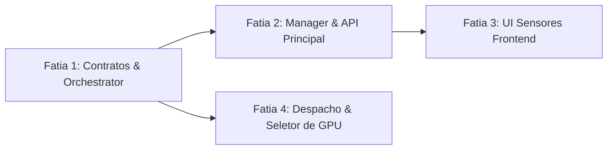

# Spec — Sensores Avançados de GPU e Seleção Multi-GPU

**Data da especificação:** 2026-09-25  
**Autor:** @orchestrator (com subsídios de `@scout`, `@backend`, `@infra`, `@frontend`)  
**Status:** Aprovada para backlog / Pronta para execução fatiada  
**Branch alvo futura:** `feat/multi-gpu-sensores-selecao` (fatiada a partir de `develop`)

---

## 1. Contexto & Objetivos

Atualmente, o monitoramento de hardware do Hephaestus LLM Studio reporta dados de GPU de forma agregada por nó (`vram_used`, `vram_total` somados e uma lista crua com strings de nomes de modelo em `gpus: Vec<String>`). Além disso, o agendamento de workloads amarra o nó a um parâmetro de boot estático `ORCH_GPU_DEVICES`, limitando sistemas com múltiplas GPUs (estações de trabalho locais com 2+ placas ou nós TrueNAS/GPU heterogêneos).

### Objetivos Principais
1. **Sensores Avançados de GPU:**
   - Coletar e reportar granularmente por GPU física: **Consumo em Watts** (`power.draw`), **Utilização em %** (`utilization.gpu`), **Temperatura em °C** (`temperature.gpu`), além de VRAM total e usada.
   - Dividir os sensores individualmente quando o nó possuir múltiplas placas.
   - Tratar nós legados, virtuais ou sem suporte a sensores com fallback gracioso (`Option<T>`).
2. **Capacidade de Seleção de GPU:**
   - Permitir ao operador escolher a GPU alvo (`gpuDevice`) nos fluxos de submissão de jobs (`/treino`, `/difusao`, autolabel, autotracker, geração img2img).
   - Resolver permanentemente a armadilha **Pitfall D9** (reboot swap de índice) utilizando **GPU UUID** de hardware em vez de índices ordinais voláteis.
   - Possibilitar a fixação do daemon de difusão em uma GPU dedicada (`DIFFUSION_DAEMON_GPU_DEVICE`) enquanto treinos efêmeros executam em outra placa do mesmo nó sem disputa de VRAM.

---

## 2. Armadilhas Conhecidas & Regras Inegociáveis

1. **Pitfall D9 (`docs/PITFALLS.md`):**
   - *Sintoma:* `--gpus "device=N"` pega a GPU errada após reboot.
   - *Causa-raiz:* O índice $N$ do `nvidia-smi` no host muda após reboot ou recarga de driver devido à enumeração não-determinística do barramento PCI pelo kernel Linux.
   - *Regra inegociável:* O identificador canônico de GPU no wire e no despacho deve ser o **GPU UUID** (ex.: `GPU-47f2e4b3-b3c1-0c31-7e89-63a510526012`). O Docker CLI e o NVIDIA Container Toolkit aceitam nativamente `--gpus "device=GPU-..."` e `-e NVIDIA_VISIBLE_DEVICES=GPU-...`. O índice numérico $N$ é aceito apenas como fallback amigável.
2. **Pitfall de VRAM Inflada (`docs/PITFALLS.md`):**
   - *Regra:* `nvidia-smi memory.used` reporta a memória alocada global na GPU (inclui processos do host, display server e containers). Nunca subtrair processos artificialmente; esse é o valor real de ocupação física da placa.
3. **Isolamento de Contratos & Nomenclatura:**
   - *Regra:* Wire público é rigorosamente `camelCase` (`packages/contracts/openapi.yaml`); estruturas internas Rust e Postgres utilizam `snake_case` (`crates/heph-contracts`).
   - Todos os endpoints e modelos devem manter 100% de retrocompatibilidade com nós single-GPU e ambientes em modo mock (CPU).

---

## 3. Especificação de Contratos & DTOs

### 3.1. DTO Canônico em `crates/heph-contracts/src/nodes.rs`

```rust
/// Telemetria detalhada de uma placa física individual.
#[derive(Debug, Clone, PartialEq, Serialize, Deserialize)]
pub struct GpuDeviceTelemetry {
    /// Índice ordinal reportado pelo host (0, 1, ...).
    pub index: u32,
    /// Identificador global único e imutável de hardware (ex.: "GPU-47f2e4b3-...").
    pub uuid: String,
    /// Nome comercial da placa (ex.: "NVIDIA GeForce RTX 3060").
    pub name: String,
    /// VRAM total em MiB.
    pub vram_total: i64,
    /// VRAM atualmente em uso no hardware em MiB.
    pub vram_used: i64,
    /// Consumo instantâneo em Watts (None se não suportado pelo driver/VM).
    #[serde(skip_serializing_if = "Option::is_none")]
    pub power_watts: Option<f64>,
    /// Utilização do núcleo da GPU em % (0..100).
    #[serde(skip_serializing_if = "Option::is_none")]
    pub gpu_utilization_pct: Option<f64>,
    /// Temperatura do die da GPU em graus Celsius.
    #[serde(skip_serializing_if = "Option::is_none")]
    pub temperature_c: Option<i32>,
}
```

### 3.2. Envelopes Internos Estendidos

- **`crates/heph-contracts/src/heartbeat.rs`:**
  ```rust
  pub struct HeartbeatBody {
      pub endpoint: String,
      pub gpus: Vec<String>, // Legado mantido
      pub vram_total: Option<i64>,
      pub vram_used: Option<i64>,
      pub cpu: Option<f64>,
      pub ram: Option<i64>,
      pub ram_total: Option<i64>,
      pub jobs_active: i32,
      pub max_gpu_mib: Option<i64>,
      /// NOVO: Lista detalhada com sensores por GPU física.
      #[serde(default, skip_serializing_if = "Vec::is_empty")]
      pub gpu_devices: Vec<GpuDeviceTelemetry>,
  }
  ```

- **`crates/heph-contracts/src/dispatch.rs`:**
  ```rust
  pub struct DispatchRequest {
      pub job_id: String,
      pub kind: String,
      pub image: String,
      pub params: serde_json::Value,
      pub config_yaml: Option<String>,
      pub weights_ref: Option<String>,
      pub package_ref: Option<String>,
      /// NOVO: Identificador estável da GPU alvo (UUID ou índice).
      #[serde(default, skip_serializing_if = "Option::is_none")]
      pub gpu_device: Option<String>,
  }
  ```

- **`crates/heph-contracts/src/nodes.rs`:**
  - `OrchestratorItem.gpu_devices: Vec<GpuDeviceTelemetry>` (default vazio).
  - `TelemetryResponse.gpu_devices: Vec<GpuDeviceTelemetry>` (default vazio).

### 3.3. Contrato Público OpenAPI (`packages/contracts/openapi.yaml`)

```yaml
    GpuDeviceTelemetry:
      type: object
      required: [index, uuid, name, vramTotal, vramUsed]
      additionalProperties: false
      description: "Telemetria individual e sensores de uma GPU física."
      properties:
        index:
          type: integer
          minimum: 0
          description: "Índice ordinal no host."
        uuid:
          type: string
          description: "UUID imutável de hardware (ex.: GPU-47f2e4b3-...)."
        name:
          type: string
          description: "Nome comercial da placa."
        vramTotal:
          type: integer
          format: int64
          description: "VRAM total em MiB."
        vramUsed:
          type: integer
          format: int64
          description: "VRAM usada em MiB."
        powerWatts:
          type: [number, "null"]
          description: "Consumo em Watts (null se não reportado pelo driver)."
        gpuUtilizationPct:
          type: [number, "null"]
          minimum: 0
          maximum: 100
          description: "Utilização do chip de processamento em %."
        temperatureC:
          type: [integer, "null"]
          description: "Temperatura do die em °C."
```

Adição aos requests de submissão de job (`YoloJobRequest`, `DiffusionJobRequest`, `DiffusionGenerateRequest`, `AutolabelJobRequest`, `AutotrackerJobRequest`):
```yaml
        gpuDevice:
          type: string
          description: "UUID ou índice da GPU alvo para execução (opcional; requer orchestratorId)."
```

---

## 4. Arquitetura de Implementação por Componente

### 4.1. Orchestrator (`services/orchestrator`)
- **Query `nvidia-smi`:**
  ```bash
  nvidia-smi --query-gpu=index,uuid,name,memory.total,memory.used,power.draw,utilization.gpu,temperature.gpu --format=csv,noheader,nounits
  ```
- **Parsing tolerante:** Tratar valores `[Not Supported]`, `[N/A]` ou erros de conversão como `None`, sem descartar a linha da GPU. Timeout estrito de 2 segundos com `kill_on_drop(true)`.
- **Docker Executor (`adapters/executor_docker.rs`):**
  Ao construir os argumentos do `docker run`:
  - Se o job trouxer `dispatch.gpu_device`: usar este device específico (`--gpus "device={gpu_device}"` e `-e NVIDIA_VISIBLE_DEVICES={gpu_device}`).
  - Se omitido: fallback para `ORCH_GPU_DEVICES` configurado no nó.
- **Daemon de Difusão (`daemon/launcher.rs`):**
  - Suportar variável `DIFFUSION_DAEMON_GPU_DEVICE` para fixar o daemon em uma GPU específica (ex.: GPU 0).
  - Se um job for alocado na mesma GPU do daemon, a rotina `maybe_preempt_daemon` suspende o daemon para evitar OOM; se for em GPU diferente, o daemon permanece quente e ativo.

### 4.2. Manager (`services/manager`)
- **Persistência de nós (`nodes/heartbeat.rs`):**
  - Serializar `req.gpu_devices` no campo `orchestrators.gpus` (JSONB) no Postgres.
  - Atualizar `TelemetryCache` em memória para reter o estado de cada GPU física por nó.
- **Eleição & Roteamento (`dispatch/election.rs`):**
  - Validar se o nó eleito (ou indicado por `orchestrator_hint`) possui a GPU solicitada e VRAM suficiente.
  - Injetar `gpu_device` no payload de despacho do job (`JobDispatchPayload`).

### 4.3. API Principal (`services/api-principal`)
- **Validação de Request:**
  - Em `services/api-principal/src/jobs/models.rs`, adicionar campo opcional `gpu_device: Option<String>` em todas as structs de request de job.
  - Validação sintática: string alfanumérica contendo hífens/dois-pontos (ex.: `GPU-[0-9a-fA-F-]+` ou índice numérico), comprimento máximo 64 caracteres.
- **Mapeamento:**
  - Repassar `gpu_device` para o manager na criação do job.

### 4.4. Frontend Web (`apps/web`)
- **Design System & Acessibilidade:**
  - Seguir os padrões Brand-Only e Dark/Glass de `docs/DESIGN.md`.
  - Alertas térmicos visuais escalonados: `<70°C` normal (zinco/brand), `70-80°C` alerta morno (`#f59e0b`), `>80°C` crítico (`status-alert`).
- **Componentes:**
  - `MultiGpuRack`: grid de placas dentro do `OrchestratorCard` e `/environments`, exibindo barra de VRAM por placa, consumo em W, carga em % e temperatura.
  - `GpuDeviceSelect`: seletor de hardware (Nó + GPU) nos formulários de setup de treino e modais de autolabel/tracker.

---

## 5. Roteiro de Fatias de Implementação



### Fatia 1: Contratos Canônicos & Coleta no Orchestrator
- Adicionar `GpuDeviceTelemetry` em `crates/heph-contracts/src/nodes.rs`.
- Estender `HeartbeatBody` e `TelemetryResponse` em `heph-contracts`.
- Atualizar `services/orchestrator/src/telemetry/gpu.rs` para a query completa do `nvidia-smi` com parsing tolerante.
- Enviar vetor `gpu_devices` no loop de heartbeat do orchestrator (`services/orchestrator/src/main.rs`).
- Cobertura com testes unitários no orchestrator simulando saídas single-GPU, dual-GPU e fallbacks de sensores ausentes.

### Fatia 2: Persistência no Manager & Exposição na API Principal
- Atualizar `services/manager/src/nodes/heartbeat.rs` e `cache.rs` para armazenar `gpu_devices`.
- Expor `gpu_devices` nos handlers `/internal/orchestrators` e `/internal/telemetry` do manager.
- Atualizar `services/api-principal/src/monitoring.rs` e `stream.rs` para expor `gpuDevices` no wire camelCase.
- Sincronizar e validar `packages/contracts/openapi.yaml`.
- Testes de serialização e integração interna entre manager e BFF.

### Fatia 3: Visualização de Sensores Avançados no Frontend
- Atualizar `apps/web/types/studio.ts` e `apps/web/lib/monitoring.ts`.
- Criar componentes de rack e métricas de GPU (`MultiGpuRack`, `ThermalBadge`).
- Integrar os novos sensores no `OrchestratorCard.tsx`, `/environments` e resumo na `Sidebar.tsx`.
- Validação visual headless via browser MCP.

### Fatia 4: Seleção e Execução de GPU nos Workloads
- Estender `DispatchRequest` com `gpu_device: Option<String>`.
- Injetar device dinâmico no `DockerExecutor` do orchestrator (`--gpus "device=..."`).
- Adicionar suporte a `DIFFUSION_DAEMON_GPU_DEVICE` no orchestrator.
- Adicionar `gpuDevice` nos requests de submit da `api-principal` e manager.
- Criar componente `GpuDeviceSelect` integrado às telas `/treino`, `/difusao` e modais de anotação.
- Smoke test final no nó de hardware real (`10.15.1.2` RTX 3060 12GB).

---

## 6. Critérios de Aceite Binários

- [ ] `cargo check --workspace` e `cargo test --workspace` 100% verdes sem warnings.
- [ ] Parse de `nvidia-smi` tolera ausência de métricas de potência/temperatura em VMs/WSL sem panic ou descarte da GPU.
- [ ] Execução com GPU UUID não sofre quebra após reboot do servidor host (validação do Pitfall D9).
- [ ] O wire HTTP público permanece estritamente `camelCase` e reflete o schema OpenAPI.
- [ ] Nós rodando em modo mock (CPU) mantêm `gpuDevices: []` e `measured: false` sem quebrar a UI.
- [ ] O daemon de difusão pode ser fixado em uma GPU dedicada sem sofrer preempção por treinos rodando em outra GPU do mesmo nó.
